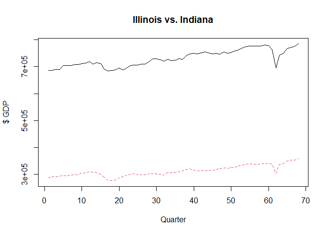

Illinois Income Tax Impact
================
Alex Brunk
2022-11-30

This will be my example for the Causal Impact model which was developed
by Google for doing A/B testing, but which I’ve used for a variety of
program and product evaluation models in my roles at both Ace Hardware
Corp and CVS Health.

The purpose of this project is to use the increase in the Illinois
income tax in 2011 to illustrate how the causal impact model can be used
to evaluate the impact of a one-time change on time series data. In this
case, we will attempt to see whether increasing the personal income tax
in Illinois had an impact on state GDP.

``` r
library(tidyverse)
library(CausalImpact)
library(janitor)
```

First thing we need to do is load the data. You can pull state GDP
information by quarter from the Bureau of Economic Analysis. This can be
easily downloaded via <https://www.bea.gov/data/gdp/gdp-state>

``` r
state_gdp_quarter <- read_csv("download.csv",skip = 4)
```

    ## Rows: 55 Columns: 70
    ## ── Column specification ────────────────────────────────────────────────────────
    ## Delimiter: ","
    ## chr  (2): GeoFips, GeoName
    ## dbl (68): 2005:Q1, 2005:Q2, 2005:Q3, 2005:Q4, 2006:Q1, 2006:Q2, 2006:Q3, 200...
    ## 
    ## ℹ Use `spec()` to retrieve the full column specification for this data.
    ## ℹ Specify the column types or set `show_col_types = FALSE` to quiet this message.

The first row is total US, last three rows are junk and we need to get
rid of them. Remove first row and last three rows from dataset

``` r
state_gdp_cleaned <- state_gdp_quarter %>%
  slice(2:(n() - 3))

rownames(state_gdp_cleaned) <- state_gdp_cleaned$GeoName
```

Now lets tranpose to make it easier to work with, get rid of our excess
rows with state names and codes, and convert to a data frame with all
numeric values.

``` r
state_gdp_cleaned <- t(state_gdp_cleaned)
state_gdp_cleaned <- state_gdp_cleaned[3:70,]
state_gdp_cleaned <- as.data.frame(state_gdp_cleaned)
state_gdp_cleaned <- state_gdp_cleaned %>%
  mutate_if(is.character,as.numeric)
```

Now, to identify a comparison state, let’s create a correlation matrix
to identify which states have the strongest correlation to Illinois in
GDP growth prior to the tax change. For a pre-period, we will select the
period from Jan 2005 through Dec 2010 (the period during which the prior
tax rate was in effect per
<https://www2.illinois.gov/rev/research/taxrates/Pages/individualprioryears.aspx>)

``` r
state_gdp_preperiod <- state_gdp_cleaned[1:24,]
illinois_gdp_preperiod <- state_gdp_preperiod[,14]

state_gdp_correlation <- c()

for(i in 1:ncol(state_gdp_preperiod)) {
  state_gdp_correlation[i] = cor(illinois_gdp_preperiod,state_gdp_preperiod[,i])
}
```

``` r
correlation_rank <- rbind(state_gdp_preperiod,state_gdp_correlation) %>%
  slice_tail() %>%
  t()

colnames(correlation_rank)[1] = "correlation_perc"
correlation_rank <- as.data.frame(correlation_rank) %>%
  arrange(desc(correlation_perc))

head(correlation_rank,10)
```

    ##                correlation_perc
    ## Illinois              1.0000000
    ## South Carolina        0.9512657
    ## Alabama               0.9037184
    ## Indiana               0.8863805
    ## Wisconsin             0.8765056
    ## Arizona               0.8753325
    ## Tennessee             0.8499985
    ## Hawaii                0.8417029
    ## Kentucky              0.8137365
    ## Iowa                  0.8110011

Among states with the strongest correlation, South Carolina and Alabama
do not have flat income taxes. Indiana on the other hand also has a flat
income tax, and made no changes to its tax rates between 2005 and 2014 -
see
<https://taxnews.ey.com/news/2021-1816-indiana-department-of-revenue-announced-county-income-tax-rate-changes-effective-october-1-2021>.
So we will use Indiana as a comparison state.

A simple chart showing Illinois vs. Indiana for the full 2005 - 2022
time period (note the Covid pandemic beginning in 2020 toward the end)

``` r
comp_data <- cbind(state_gdp_cleaned[,14],state_gdp_cleaned[,15])

# Visualize the comparison
matplot(comp_data,type="l",ylab='$ GDP',xlab='Quarter',main='Illinois vs. Indiana')
```

<!-- -->
<p>

Now, using the 2005 to 2010 window for our pre-period, and the 2011 to
2014 window while the increased Illinois income tax was in effect for
our post-period, let’s see if there appears to have been an impact on
state GDP from the higher tax.

To test the impact, we will use the Causal Impact package
(documentation:
<https://google.github.io/CausalImpact/CausalImpact.html>) which relies
on a Bayesian structural time series model to predict future data in a
time series based on past trends.

``` r
pre.period <- c(1,24)
post.period <- c(25,40)

impact <- CausalImpact(comp_data,pre.period,post.period)

plot(impact)
```

<!-- -->

``` r
summary(impact)
```

    ## Posterior inference {CausalImpact}
    ## 
    ##                          Average              Cumulative        
    ## Actual                   7.3e+05              1.2e+07           
    ## Prediction (s.d.)        7.1e+05 (2133)       1.1e+07 (34134)   
    ## 95% CI                   [7.1e+05, 7.2e+05]   [1.1e+07, 1.1e+07]
    ##                                                                 
    ## Absolute effect (s.d.)   14874 (2133)         237980 (34134)    
    ## 95% CI                   [10655, 19081]       [170480, 305288]  
    ##                                                                 
    ## Relative effect (s.d.)   2.1% (0.31%)         2.1% (0.31%)      
    ## 95% CI                   [1.5%, 2.7%]         [1.5%, 2.7%]      
    ## 
    ## Posterior tail-area probability p:   0.00123
    ## Posterior prob. of a causal effect:  99.87745%
    ## 
    ## For more details, type: summary(impact, "report")

Counterintuitively, it appears that Illinois’s GDP increased relative to
Indiana in the years following the tax hike. I don’t have a good
explanation for a tax hike as a positive causal impact on state GDP.
It’s possible that the increase in taxes gave investors and businesses
confidence that Illinois was solving its economic issues, or that the
economy simply improved for other reasons.

It’s also possible that my use of a single state is not terribly
representative in this situation, and I would be btter off using a
synthetic control methdology. I also need to get together a better
dataset of state tax policy changes during the period in question. The
AI Model Claude (3.5 Sonnet) assisted me in pulling together
<a href="state_tax_changes.csv">this dataset</a>.
